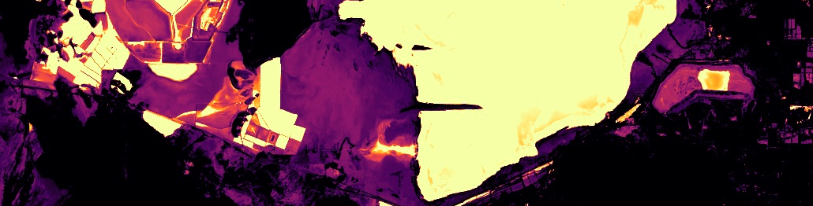
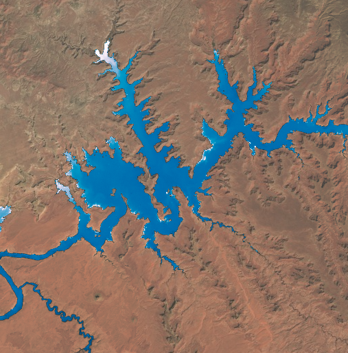
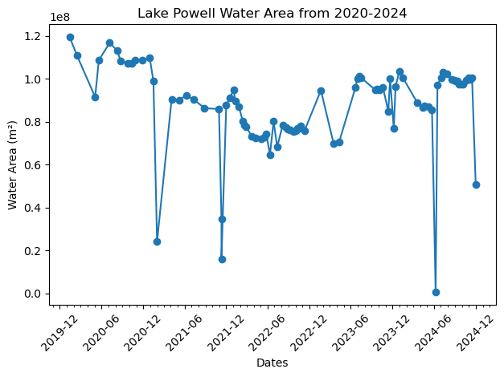

[](https://pypi.org/project/RadGEEToolbox/)

# RadGEEToolbox 🛠



### 🌎 Streamlined Multispectral & SAR Analysis for Google Earth Engine Python API

### [See documentation here](https://radgeetoolbox.readthedocs.io/en/latest/)

**RadGEEToolbox** is an open-source Python package that simplifies the processing and analysis of satellite imagery using the Google Earth Engine Python API. It provides ready-to-use tools for filtering, masking, mosaicking, spectral index calculations, and extracting statistics from multispectral (Landsat, Sentinel-2) and SAR (Sentinel-1) datasets.

Designed for both new and advanced users of Google Earth Engine, RadGEEToolbox minimizes repetitive scripting, accelerates common remote sensing workflows, and aims to maximize efficiency within the constraints of the Google Earth Engine API. Whether you’re building a time series of vegetation indices or extracting surface properties along transects, this package helps get results faster.

_________

## Key Features

- Modular tools for processing **Landsat, Sentinel-1 SAR, and Sentinel-2** imagery
- Efficient filtering, masking, and mosaicking of Earth Engine image collections
- Built-in support for computing **spectral indices** (NDWI, NDVI, LST, turbidity, chlorophyll, etc.)
- SAR utilities for **multilooking**, **speckle filtering**, and **backscatter conversion**
- Automated extraction of **transect and zonal statistics** across image collections
- Easy conversion between RadGEEToolbox and standard Earth Engine objects
- Server-side–friendly workflows and caching for faster, scalable processing

🔍 For a full breakdown of available tools, see the [RadGEEToolbox documentation »](https://radgeetoolbox.readthedocs.io/en/latest/)

_____________

## Installation Instructions

### Prerequisites

- **Python**: Ensure you have version 3.6 or higher installed.
- **pip**: This is Python's package installer. 
- **conda-forge**: Community led Conda package installer channel

### Installing via pip

To install `RadGEEToolbox` version 1.6.1 using pip (NOTE: it is recommended to create a new virtual environment):

```bash
pip install RadGEEToolbox==1.6.1
```

### Installing via Conda

To install `RadGEEToolbox` version 1.6.1 using conda-forge (NOTE: it is recommended to create a new virtual environment):

```bash
conda install conda-forge::radgeetoolbox
```

### Manual Installation from Source

1. **Clone the Repository**: 
   ```bash
   git clone https://github.com/radwinskis/RadGEEToolbox.git
   ```

2. **Navigate to Directory**: 
   ```bash
   cd RadGEEToolbox
   ```

3. **Install the Package**:
   ```bash
   pip install .
   ```

### ✅ Verifying the Installation

To verify that `RadGEEToolbox` was installed correctly:

```python
python -c "import RadGEEToolbox; print(RadGEEToolbox.__version__)"
```

You should see `1.6.1` printed as the version number.

________
# Usage Example

Below is an example use case using the `LandsatCollection` module to create an NDWI image collection, create water classification maps, and create a time series of water area.

### 1. Create a Filtered Landsat Image Collection

```python
# 1. Import necessary packages and modules
import ee
from RadGEEToolbox import LandsatCollection

# 2. Authenticate & Initialize GEE API
ee.Authenticate()
ee.Initialize()

# 3. Define study area boundary - in this case Lake Powell, Utah
study_area = ee.Geometry.Polygon(
        [[[-111.35875055487008, 37.19999663127137],
          [-111.35875055487008, 37.00119876939416],
          [-111.12048456365915, 37.00119876939416],
          [-111.12048456365915, 37.19999663127137]]])

# 3. Create a Landsat image collection for a given time range and study area
# includes filtering imagery based on areal percentage of cloud cover
# WRS-2 tile(s) can also be used for filtering instead of an ROI geometry
collection = LandsatCollection(
    start_date='2020-01-01', #date formats of 'YYYY-MM-DD'
    end_date='2025-01-01',
    cloud_percentage_threshold=10, #filtering to <10% cloud coverage
    boundary=study_area #ee.Geometry() of your study area
    )

# 4. Check collection by printing the dates of all images in the collection
dates = collection.dates 
print(dates)
```
### 2. Apply a Cloud Mask and Compute NDWI
```python
# 1. Mask clouds 
cloud_masked_collection = collection.masked_clouds_collection
# 2. Create a collection of singleband NDWI images with band names of 'ndwi'
cloud_masked_NDWI_collection = cloud_masked_collection.ndwi
# BONUS - 3. Create water classification maps using a user-set binary NDWI threshold
water_classification_maps = cloud_masked_collection.ndwi_collection(
      threshold=0
      )
```


### 3. Calculate Water Area Time Series
```python
calculate_water_area = cloud_masked_NDWI_collection.PixelAreaSumCollection(
      band_name='ndwi', #specify band to use from collection
      geometry=study_area), #ee.Geometry() of your study area
      threshold=0, #binary classification threshold for unclassified rasters,
      scale=90 #pixel size for zonal statistics
      )
print('List of square meters of water in images:', 
      calculate_water_area.aggregate_array('ndwi').getInfo())
```



For details about Sentinel-1 SAR and Sentinel-2 MSI modules, and all other available Landsat or cross-module functions, please refer to the [RadGEEToolbox documentation](https://radgeetoolbox.readthedocs.io/en/latest/). You can also explore [`/Example Notebooks`](https://github.com/radwinskis/RadGEEToolbox/tree/main/Example%20Notebooks) for more usage examples.

________


## Contributing

Contributions are welcome! If you’d like to suggest a feature, report a bug, or contribute code or documentation, please visit the [GitHub Issues](https://github.com/radwinskis/RadGEEToolbox/issues) page to get started or view the `CONTRIBUTING.md` file in the main directory.

____ 

## License

RadGEEToolbox is released under the MIT License.


