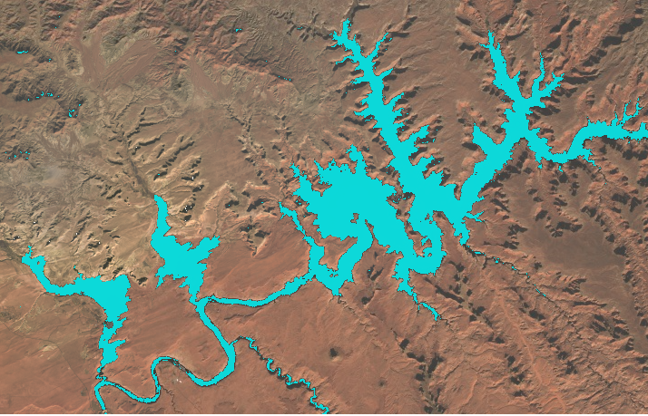
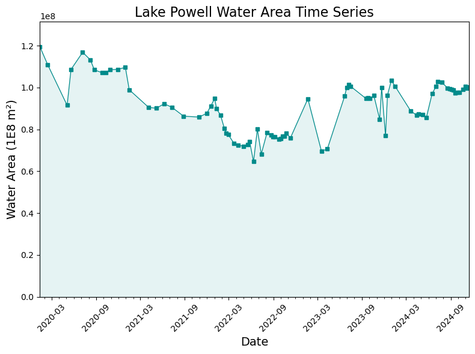

[](https://pypi.org/project/RadGEEToolbox/)

# RadGEEToolbox 🛠


### 🌎 Streamlined Multispectral & SAR Analysis for Google Earth Engine Python API

### [See documentation here](https://radgeetoolbox.readthedocs.io/en/latest/)

**RadGEEToolbox** is an open-source Python package that simplifies the processing and analysis of satellite imagery using the Google Earth Engine Python API. It provides ready-to-use tools for filtering, masking, mosaicking, spectral index calculations, and extracting statistics from multispectral (Landsat, Sentinel-2) and SAR (Sentinel-1) datasets.

Designed for both new and advanced users of Google Earth Engine, RadGEEToolbox minimizes repetitive scripting, accelerates common remote sensing workflows, and aims to maximize efficiency within the constraints of the Google Earth Engine API. Whether you’re building a time series of vegetation indices or extracting surface properties along transects, this package helps get results faster.

Although similar packages exist (eemont, geetools, etc.), `RadGEEToolbox` extends functionality and provides cohesive, chainable methods for research oriented projects working with Landsat TM & OLI, Sentinel-1 SAR, and/or Sentinel-2 MSI datasets (Table 1). The ultimate goal of `RadGEEToolbox` is to make satellite image processing easier and faster for real world applications relying on the most commonly utilized remote sensing platforms.

***Table 1.*** *Comparison of functionality between RadGEEToolbox, eemont, and geetools.*

| Capability | **RadGEEToolbox** | **eemont** | **geetools** |
|:--------------:|:---:|:---:|:---:|
| **Dataset & Workflow Specific API's** | **YES** | NO | NO |
| **Synthetic Aperture Radar (S1) Support** | **YES** | NO | NO |
| **Zonal Time-series Extraction** | **YES** | **YES** | **YES** |
| **Area Time-series Extraction** | **YES** | NO | NO |
| **Transect Time-series Extraction** | **YES** | NO | NO |
| **Comprehensive Preprocessing Operations** | **YES** | **YES** | **YES** |
| **Reflectance Scaling (DN to ρ)** | **YES** | **YES** | **YES** |
| **Land Surface Temperature Calculation (Landsat)** | **YES** | NO | NO |
| **Image Selection by Date or Index** | **YES** | **YES** | NO |
| **Visualization Presets/Tools** | **YES** | NO | NO |

_________
## Getting Started with Google Earth Engine

**RadGEEToolbox requires [access](https://developers.google.com/earth-engine/guides/access) to [Google Earth Engine (GEE)](https://earthengine.google.com/) and proper [authentication](https://developers.google.com/earth-engine/guides/auth) with the Python API.**

For more details, see the official [Google Earth Engine Python API Getting Started Guide](https://developers.google.com/earth-engine/guides/quickstart_python) or [Python Installation Guide](https://developers.google.com/earth-engine/guides/python_install).


### 1. Sign Up for Earth Engine
Apply for access here: [https://earthengine.google.com/signup/](https://earthengine.google.com/signup/) using a Google account. Approval typically takes a few days.

### 2. Install the Earth Engine Python API
**The Earth Engine API is installed automatically when you install `RadGEEToolbox`.** However, if you would like to install manually:

```bash
pip install earthengine-api
```

### 3. Authenticate & Initialize
Prior to using the Earth Engine Python client library, you need to authenticate and use the resultant credentials to initialize the Python client. The authentication flows use Cloud Projects to authenticate, and they're used for unpaid (free, noncommercial) use as well as paid use.


**Run the following during your first use:**
```python
import ee
ee.Authenticate()
```
***NOTE: Your GEE credentials will not permanantly be stored on your PC and you will periodically need to re-run `ee.Authenticate()` when `ee.Initialize()` returns an authentication error.***

`ee.Autheticate()` will select the best authentication mode for your environment, and prompt you to confirm access for your scripts. To initialize, you will need to provide a project that you own, or have permissions to use. This project will be used for running all Earth Engine operations:

```python
ee.Initialize(project='my-project')
```
Replacing 'my-project' with the name of the Google Cloud Project you created on sign-up or any Google Cloud Project that has the GEE API enabled.

### 4. Authentication Best Practices
It is reccomended to use the following authentication procedure once you have completed your initial authentication:
```python
import ee

try:
    ee.Initialize()
except Exception as e:
    ee.Authenticate()
    ee.Initialize()
```

### 5. Troubleshooting
`AttributeError: module 'ee' has no attribute 'Initialize'`

➤ Ensure that earthengine-api is installed properly.

`403 Access Denied`

➤ Your GEE account might not be approved, or the API is not enabled for your project.

`Initialization fails`

➤ Try using `ee.Initialize(project='your-project-id')` explicitly in case you are just calling `ee.Initialize()`

See the official [GEE documentation for authentication »](https://developers.google.com/earth-engine/guides/auth)

_________

## Key Features

- Modular tools for processing **Landsat, Sentinel-1 SAR, and Sentinel-2** imagery
- Efficient filtering, masking, and mosaicking of Earth Engine image collections
- Built-in support for computing **spectral indices** (NDWI, NDVI, LST, turbidity, chlorophyll, etc.)
- SAR utilities for **multilooking**, **speckle filtering**, and **backscatter conversion**
- Automated extraction of **transect and zonal statistics** across image collections
- Easy conversion between RadGEEToolbox and standard Earth Engine objects
- Server-side–friendly workflows and caching for faster, scalable processing

Features of `RadGEEToolbox` will be expanded in the future - if there is something you would like to see implemented in `RadGEEToolbox`, please open an issue or discussion on GitHub.

🔍 For a full breakdown of available tools, see the [RadGEEToolbox documentation »](https://radgeetoolbox.readthedocs.io/en/latest/)

_____________

## Installation Instructions

### Prerequisites

- **Python**: Ensure you have version 3.8 or higher installed.
- **pip**: This is Python's package installer. 
- **conda-forge**: Community led Conda package installer channel

### Installing via pip

To install `RadGEEToolbox` version 1.6.7 using pip (NOTE: it is recommended to create a new virtual environment):

```bash
pip install RadGEEToolbox==1.6.7
```

### Installing via Conda

To install `RadGEEToolbox` version 1.6.7 using conda-forge (NOTE: it is recommended to create a new virtual environment):

```bash
conda install conda-forge::radgeetoolbox
```

### Manual Installation from Source

1. **Clone the Repository**: 
   ```bash
   git clone https://github.com/radwinskis/RadGEEToolbox.git
   ```

2. **Navigate to Directory**: 
   ```bash
   cd RadGEEToolbox
   ```

3. **Install the Package**:
   ```bash
   pip install .
   ```

### ✅ Verifying the Installation

To verify that `RadGEEToolbox` was installed correctly:

```python
python -c "import RadGEEToolbox; print(RadGEEToolbox.__version__)"
```

You should see `1.6.7` printed as the version number.

### Want to Visualize Data? Install These Too

The core functionality of this package is focused on the processing of geospatial and remote sensing data using Google Earth Engine. It does **not** include interactive mapping functionality by default.

**If you wish to view GEE data on interactive maps (e.g., following along with the mapping portions of the [example notebooks](https://github.com/radwinskis/RadGEEToolbox/tree/main/Example%20Notebooks)), you will need to install the [optional `geemap` package](https://geemap.org) in the environment that `RadGEEToolbox` is installed:**

```python
pip install geemap
```
or 

```bash
conda install conda-forge::geemap
```
**If you plan to use `geemap` in a Jupyter Notebook, you will also need to install `ipykernel`:**

```python
pip install ipykernel
```
or 

```bash
conda install anaconda::ipykernel
```
________
# Usage Example

Below is an example use case using the `LandsatCollection` module to create an NDWI image collection, create water classification maps, and create a time series of water area.

### 1. Create a Filtered Landsat Image Collection

```python
# 1. Import necessary packages and modules
import ee
from RadGEEToolbox import LandsatCollection

# 2. Authenticate & Initialize GEE API
ee.Authenticate()
ee.Initialize(project='my-cloud-project-ID) #replace with your Google Cloud project ID

# 3. Define study area boundary - in this case Lake Powell, Utah
study_area = ee.Geometry.Polygon(
        [[[-111.35875055487008, 37.19999663127137],
          [-111.35875055487008, 37.00119876939416],
          [-111.12048456365915, 37.00119876939416],
          [-111.12048456365915, 37.19999663127137]]])

# 3. Create a Landsat image collection for a given time range and study area
# includes filtering imagery based on areal percentage of cloud cover
# WRS-2 tile(s) can also be used for filtering instead of an ROI geometry
collection = LandsatCollection(
    start_date='2020-01-01', #date formats of 'YYYY-MM-DD'
    end_date='2025-01-01',
    cloud_percentage_threshold=10, #filtering to <10% cloud coverage
    boundary=study_area #ee.Geometry() of your study area
    )

# 4. Check collection by printing the dates of all images in the collection
dates = collection.dates 
print(dates)
```
```
['2020-01-13', '2020-02-14', '2020-05-04', '2020-05-20', '2020-07-07', '2020-08-08', '2020-08-24', '2020-09-25', '2020-10-11', '2020-10-27', '2020-11-28', '2020-12-30', '2021-01-15', '2021-01-31', '2021-04-05', '2021-05-07', '2021-06-08', '2021-07-10', '2021-08-27', '2021-10-30', '2021-11-10', '2021-11-10', '2021-12-01', '2021-12-17', '2022-01-02', '2022-01-10', '2022-01-26', '2022-02-11', '2022-02-19', '2022-02-27', '2022-03-23', '2022-04-08', '2022-05-02', '2022-05-18', '2022-05-26', '2022-06-11', '2022-06-27', '2022-07-13', '2022-08-06', '2022-08-22', '2022-08-30', '2022-09-07', '2022-09-23', '2022-10-01', '2022-10-09', '2022-10-17', '2022-10-25', '2022-11-10', '2023-01-21', '2023-03-18', '2023-04-11', '2023-06-22', '2023-06-30', '2023-07-08', '2023-07-16', '2023-09-18', '2023-09-26', '2023-10-04', '2023-10-20', '2023-11-13', '2023-11-21', '2023-12-07', '2023-12-15', '2023-12-31', '2024-01-16', '2024-03-20', '2024-04-13', '2024-04-21', '2024-05-07', '2024-05-23', '2024-06-08', '2024-06-16', '2024-07-02', '2024-07-10', '2024-07-26', '2024-08-19', '2024-08-27', '2024-09-04', '2024-09-12', '2024-09-20', '2024-09-28', '2024-10-06', '2024-10-22', '2024-10-30', '2024-11-07', '2024-11-15', '2024-12-01']
```
### 2. Apply a Cloud Mask and Compute NDWI
```python
# 1. Mask clouds 
cloud_masked_collection = collection.masked_clouds_collection
# 2. Create a collection of singleband NDWI images with band names of 'ndwi'
cloud_masked_NDWI_collection = cloud_masked_collection.ndwi
# BONUS - 3. Create water classification maps using a user-set binary NDWI threshold
water_classification_maps = cloud_masked_collection.ndwi_collection(
      threshold=0
      )
```



***Visualization of true color and classified water (in blue) from one of the dates in the collection. To see the code used to display this image, please view [this Example Notebook](https://github.com/radwinskis/RadGEEToolbox/blob/main/Example%20Notebooks/Complete_ReadMe_Example.ipynb)***

### 3. Calculate Water Area Time Series
```python
calculate_water_area = cloud_masked_NDWI_collection.PixelAreaSumCollection(
      band_name='ndwi', #specify band to use from collection
      geometry=study_area, #ee.Geometry() of your study area
      threshold=0, #binary classification threshold for unclassified rasters,
      scale=90 #pixel size for zonal statistics
      )
water_area_time_series = calculate_water_area.aggregate_array('ndwi').getInfo()
print('List of square meters of water in images:', water_area_time_series)
```



***To see the code used to display this plot, please view [this Example Notebook](https://github.com/radwinskis/RadGEEToolbox/blob/main/Example%20Notebooks/Complete_ReadMe_Example.ipynb)***

For details about Sentinel-1 SAR and Sentinel-2 MSI modules, and all other available Landsat or cross-module functions, please refer to the [RadGEEToolbox documentation](https://radgeetoolbox.readthedocs.io/en/latest/). You can also explore [`/Example Notebooks`](https://github.com/radwinskis/RadGEEToolbox/tree/main/Example%20Notebooks) for more usage examples.

________


## Contributing

Contributions are welcome! If you’d like to suggest a feature, report a bug, or contribute code or documentation, please visit the [GitHub Issues](https://github.com/radwinskis/RadGEEToolbox/issues) page to get started or view the `CONTRIBUTING.md` file in the main directory.

____ 

## License

RadGEEToolbox is released under the MIT License.


