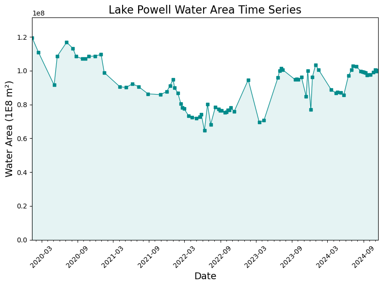

Usage Example
=============

Below is an example use case using the ``LandsatCollection`` module to create
an NDWI image collection, generate water classification maps, and calculate
a time series of surface water area.

Please see example notebooks for more details and examples, or feel free to request additional examples or assistance on GitHub.

1. Create a Filtered Landsat Image Collection
---------------------------------------------

::

    # 1. Import necessary packages and modules
    import ee
    from RadGEEToolbox import LandsatCollection

    # 2. Authenticate & Initialize GEE API
    ee.Authenticate()
    ee.Initialize()

    # 3. Define study area boundary - in this case Lake Powell, Utah
    study_area = ee.Geometry.Polygon(
        [[[-111.35875055487008, 37.19999663127137],
          [-111.35875055487008, 37.00119876939416],
          [-111.12048456365915, 37.00119876939416],
          [-111.12048456365915, 37.19999663127137]]])

    # 4. Create a Landsat image collection
    collection = LandsatCollection(
        start_date='2020-01-01',
        end_date='2025-01-01',
        cloud_percentage_threshold=10,
        boundary=study_area
    )

    # 5. Check collection by printing image dates
    dates = collection.dates 
    print(dates)

2. Apply a Cloud Mask and Compute NDWI
--------------------------------------

::

    # 1. Mask clouds 
    cloud_masked_collection = collection.masked_clouds_collection

    # 2. Generate NDWI image collection
    cloud_masked_NDWI_collection = cloud_masked_collection.ndwi

    # 3. (Optional) Classify water using a binary NDWI threshold
    water_classification_maps = cloud_masked_collection.ndwi_collection(
        threshold=0
    )


Visualization of true color and classified water (in blue) from one of the dates in the collection. 

To see the code used to display this image, please view `this Example Notebook <https://github.com/radwinskis/RadGEEToolbox/blob/main/Example%20Notebooks/Complete_ReadMe_Example.ipynb>`_

3. Calculate Water Area Time Series
-----------------------------------

::

    calculate_water_area = cloud_masked_NDWI_collection.PixelAreaSumCollection(
        band_name='ndwi',
        geometry=study_area,
        threshold=0,
        scale=90
    )

    print('List of square meters of water in images:',
          calculate_water_area.ExportProperties('ndwi'))



To see the code used to display this plot, please view `this Example Notebook <https://github.com/radwinskis/RadGEEToolbox/blob/main/Example%20Notebooks/Complete_ReadMe_Example.ipynb>`_

You can also explore the
`Example Notebooks <https://github.com/radwinskis/RadGEEToolbox/tree/main/Example%20Notebooks>`_
for more usage examples.

NOTE for those newer to Python: when you see `property` next to the function name in the RadGEEToolbox documentation, 
you do not need to add parentheses at the end of the function when calling the function. 
For example: ```my_image_collection.add_date_property``` calls the `add_date_property` property function upon the `my_image_collection` image collection - 
no parentheses needed. All other non-property functions require one or more arguments to be specified by the user, and will require the use of parentheses 
to define the function arguments.